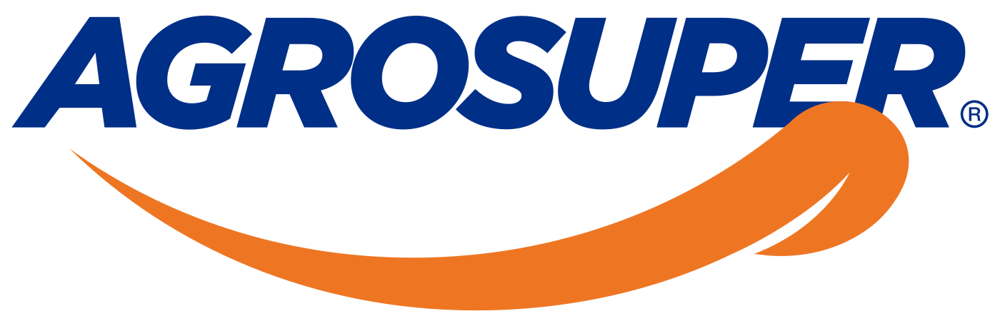

 
 

## RETO LEGAL HACKATHON- AGROSUPER
### DEFINICIÓN DEL PRODUCTO

Este proyecto es una plataforma web que permite clientes internos  hacer sus solicitudes legales de una manera intuitiva y rapida,  asi mismo, a los abogados les permite ver el numero de solicitudes que tienen pendientes con todos los datos necesarios para asi reducir tiempos de gestion y ser mas efectivos a la hora de resolver estas solicitudes. 
Permite iniciar sesion con la cuenta corporativa de Office 365 de Agrosuper, para asi facilitar el envio de las solicitudes a sus respectivos correos y asi, evitar confusion de la asignacion de cada caso a su respectivo abogado.

**************************************************************************
## **ANTECEDENTES**

Somos un equipo de abogados que frecuentemente recibimos solicitudes de contratos de servicios de parte de nuestros clientes que trabajan en todas las áreas de la compañía.

Hoy en día, para efectuar una solicitud de un nuevo contrato, nuestros clientes nos envían por correo electrónico una planilla en formato Word con cierta información que necesitamos para redactar el contrato. Además, nos envían otro archivo, en que señale lo más detallado posible en que consta el servicio que debemos regular, para incorporarlo al contrato.

Estas solicitudes se hacen por correo electrónico directamente al abogado que está a cargo del área sobre el cual se pide el contrato. Además, muchas veces se hace con información incompleta (no se envían todos los antecedentes necesarios), por lo que los abogados a cargo de redactar los contratos deben volver con sus clientes y preguntarles la información faltante.

*******************************************************************************************

### DATOS

 - Nuestra compañía actualmente cuenta con más de 9.400 proveedores, dentro de los cuales se incluyen los prestadores de servicios, divididos en aquellos que prestan servicios habituales a la empresa, como los que prestan servicios esporádicos. Al menos todos los servicios habituales (es decir, que se prestan servicios con cierta frecuencia) deben contar con un contrato suscrito por ambas partes.
 - Hoy en día invertimos mucho tiempo en trabajo administrativo como recolección de los datos mínimos para elaborar un contrato. Nuestra idea es contar con una plataforma de fácil revisión que cuente con toda la información enviada. Asimismo, al estar en esta plataforma, podemos evitar el uso del correo electrónico como lista de pendientes haciendo más eficiente nuestra gestión y usar una mayor cantidad de tiempo en trabajos que den un mayor valor agregado a la compañía.

************************************************************************************
### RETO
Te pedimos que nos ayudes a desarrollar una plataforma en la cual un usuario utilizando la misma contraseña de ingreso a su computador de trabajo (office 365) pueda:

 - [x] ingresar a una página web tipo formulario, en que a partir de ciertas preguntas que se incluyan, puedan completar o seleccionar una alternativa determinada de las existentes. Así, y a menos que se seleccione la alternativa N/A (la cual solo estará disponible en alguna de las preguntas), no será posible enviar la solicitud al abogado correspondiente.
 - [x] Una vez completa la solicitud, está se le envíe por correo al abogado a cargo del área de servicios, distinción que les enviaremos previamente. Esta solicitud deberá venir con un número de ticket.

 

 - [x] Todos estos requerimientos, además de ser enviados a los abogados, debería poder ser vistos en una plataforma general, a la que solo los abogados tendrán acceso. Dentro de ella, podrán verse todos los ticket generados, con el nombre de quién generó la solicitud y con el del abogado a cargo respectivo, incluyendo una especie de checkbox de tarea o estado del asunto para efectos de que este realice el seguimiento.
 
 - [ ] Que dentro de esta plataforma, se pueda modificar los abogados a cargo de ciertas áreas, por si fuera necesario por vacaciones o ausencias de miembros del equipo. También se debería poder incluir a nuevos abogados que se integren al equipo con sus respectivas áreas a cargo.
 - [ ] Poder generar reportes sobre las solicitudes realizadas y exportarlos tanto en Word como PDF, y que puedan ser enviados a través del correo electrónico.

 *Tomar en cuenta:*
 
 - [x] Dentro de los campos rellenables por los clientes, habrá algunas opciones que se deberán elegir entre ciertas alternativas, marcar con un ticket, o rellenar un espacio en blanco.
 - [ ] En las que se debe rellenar un espacio en blanco, la idea es que haya un símbolo de (?) o similar, donde, al poner el cursor sobre él, se señale una explicación de lo que necesitamos que se detalle en dicho campo. Esas definiciones se entregarán por nosotros.
 - [x] No se debe permitir que se envíe la solicitud final si no se completan todos los campos. Solo en algunos de ellos va a ser posible seleccionar la alternativa N/A.
 - [ ] Idealmente y si el proceso lo permite, nos gustaría hacer la prueba de que en base a las respuestas que se incluyan, se genere un contrato tipo que se incluya en la solicitud que se envíe al abogado. Esta prueba la podríamos hacer con un solo tipo de contrato para ver cómo funcionaría.

************************************************************

*¿Cómo ver este proyecto?*

Solo necesitas un navegador y dar click en el siguiente link: https://agrosuper-legal-hackaton-2020.web.app/

*************************************************************
